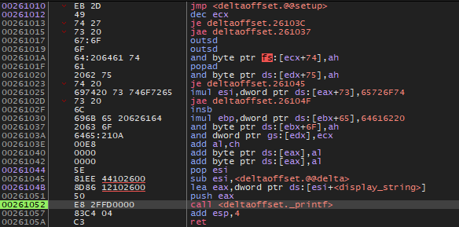
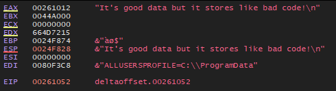
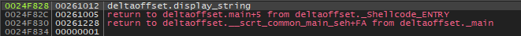

# DeltaOffset
Demonstrates how to use the delta offset trick for PIC

## The problem
When executing shellcode our position in memory is unknown therefore any code we execute needs to be dynamically calculated at runtime.

We also don't have access to a .data or .rdata section meaning we can't easily store data.

By utilising the delta offset trick we can calculate the offset to our program's start in order to reference data that is packed into the code section.

### Disassembly

### Registers

### Stack

